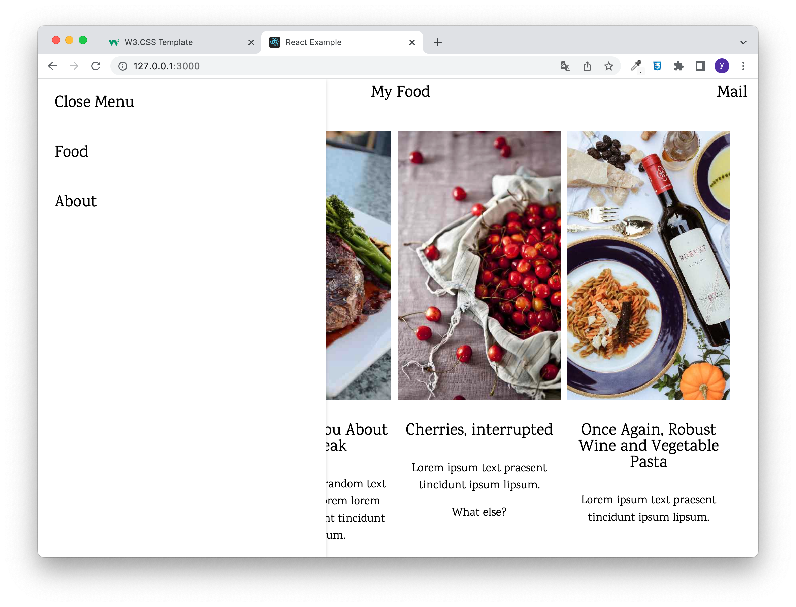

# 유지인 React 클론코딩(3) 과제

> 2022-10-28

## index.js

```javascript
/**
 * @filename: index.js
 * @description: 메인 페이지 구성
 */

/** 패키지 참조 */
import React from 'react';
import styled from 'styled-components';
import Food from './Food';
import About from './About';

// 메인페이지 영역에 대한 스타일 정의
const MainContainer = styled.section`
  max-width: 1200px;
  padding: 8px 16px;

`;

/**
 * 메인페이지 레이아웃 구성 함수
 * @returns {JSX.Element}
 */
const Main = () => {
  return (
    <MainContainer>
        <Food />
        <hr />
        <About />
        <hr />
    </MainContainer>
  );
};

export default Main;
```


## App.js

```javascript
/**
 * @filename: App.js
 * @description: 레이아웃 구성 컨테이너
 */

/** 패키지 참조 */
import React, { memo } from "react";
// 라우팅처리
import {Routes, Route} from 'react-router-dom';
// 모든 페이지 공용 컴포넌트
import Header from "./common/Header";
import Footer from './common/Footer';
import Main from './pages/Main';

/**
 * 기본 레이아웃 구성 함수
 * @returns {JSX.Element}
 */
const App = memo(() => {
  return (
   <div>
    <Header />
    <Routes>
      <Route path='/' exact={true} element={<Main />} />
    </Routes>
    <Footer />
   </div>
  );
});

export default App;
```


## GlobalStyle.js

```javascript
/**
 * @filename: GlobalStyles.js
 * @description: 전역으로 적용될 기본 스타일시트.
 *               이 파일에서 정의한 class는 RecatJSX에서 className 속성으로 참조해야 한다.
 */

/** 패키지 참조 */
import { createGlobalStyle } from "styled-components";
// reset.css
import reset from "styled-reset";

/**
 * 전역 스타일 시트를 정의한 객체
 * @type {GlobalStyleComponent}
 */
const GlobalStyle = createGlobalStyle`
    ${reset}

    body {
        margin: 0;
        padding: 0;
        font-family:"Karma",serif

  }

    a {
        text-decoration: none;
    }

    h3 {
        padding: 30px 0 16px 0;
        font-size: 24px;
        font-weight: 500;
    }

    h4 {
        font-size: 20px;
        margin: 10px 0;
        font-weight: 500;
    }

    h6 {
        font-size: 16px;
        margin: 10px 0;
        i {
            font-style: italic;
        }
    }

    p {
        font-size: 17px;
        margin : 15px 0;
        line-height: 1.5;
    }

    hr {
        margin : 20px 0px;
        padding: 10px 16px;
        border: none;
        width: 90%;
        margin: auto;
        border-top : 0.3px solid #eee;
    }
`;

export default GlobalStyle;
```

## common/Header.js

```javascript
/**
 * @filename: Header.js
 * @description: Header 공통 컴포넌트
 */

/** 패키지 참조 */
import React, { memo, useCallback } from 'react';
import styled from 'styled-components';
import { HashLink } from 'react-router-hash-link';
import SideNav from '../component/SideNav';

/** Header 컴포넌트 스타일 정의 */
const HeaderContainer = styled.header`
   display: flex;
   justify-content: space-between;
   padding: 10px 16px;
   box-sizing: border-box;
   width: 100%;
   position: fixed;
   z-index: 9999;
   background-color: #fff;
   font-size: 24px;

   a {
    color: #000;
    display: block;
    padding: 8px 16px;
    box-sizing: border-box;
    &:hover {
      background-color: #d5d5d5;
    }
   }
`;

const Header = memo(() => {
  const showSideMenu = useCallback(() => {
    document.querySelector('.sideNav').style.display = 'block';
  });

  return (
    <HeaderContainer>
        <HashLink to='#' onClick={showSideMenu}><i class="fa-sharp fa-solid fa-bars" /></HashLink>
        <SideNav />
        <div>My Food</div>
        <div>Mail</div>
    </HeaderContainer>
  );
});

export default Header;
```

## common/Footer.js

```javascript
/**
 * @filename: Footer.js
 * @description: Footer 공통 컴포넌트
 */

/** 패키지 참조 */
import React, { memo } from 'react';
import styled from 'styled-components';
import mq from '../MediaQuery';

import img01 from '../assets/img/workshop.jpg';
import img02 from '../assets/img/gondol.jpg';

/** Footer 컴포넌트 스타일 정의 */
const FooterContainer = styled.footer`
  padding : 10px 16px;
  width: 90%;
  margin: auto;
  display: flex;
  ${mq.maxWidth('sm')`
    flex-direction: column;
  `}
  
  div {
    width: 33.3%;
    padding: 0 8px;
    box-sizing: border-box;
    ${mq.maxWidth('sm')`
      width: 100%;
    `}

    &:first-child {
      a {
        text-decoration: underline;
      }
    }

    &:nth-child(2) {
      ul {
        
        li {
          display: flex;
          width: 100%;
          padding: 16px;
          box-sizing: border-box;
          &:hover {
            background-color: #d5d5d5;
          }
          &:first-child {
            border-bottom: solid 0.7px #d5d5d5;
          }
          div {
            &:first-child {
              flex-basis: 0;
              img {
                width: 50px;
              }
            }
            &:last-child {
              width: 100%;
              span {
                display: block;
                box-sizing: border-box;
                flex: none;
                &:first-child {
                  font-size: 18px;
                }
              }
            }
          }
        }
      }
    }

    &:last-child {
      p {
        display: flex;
        flex-wrap: wrap;
        align-items: baseline;

        span {
          display: block;
          color: #fff;
          background-color: #616161;
          margin: 0 10px 16px 0;
          padding: 0 8px;
          box-sizing: border-box;
          font-size: 12px;

          &:first-child {
            background-color: #000;
            font-size: 15px;
          }
        }
      }
    }
  }
`;

// 이미지와 텍스트에 대한 JSON 배열
const imgList = [
  {img: img01, title:'Lorem', desc:'Sed mattis nunc'},
  {img: img02, title:'Ipsum', desc:'Praes tinci sed'}
];

// span 태그 생성을 위한 배열
const tagArr = ['Travel', 'New York', 'Dinner', 'Salmon', 'France', 'Drinks', 'Ideas', 'Flavors', 'Cuisine', 'Chicken', 'Dressing', 'Fried', 'Fish', 'Duck'];

/**
 * 페이지 하단 컴포넌트 구현
 * @returns {JSX.Element}
 */
const Footer = memo(() => {
  return (
    <FooterContainer>
      <div>
        <h3>FOOTER</h3>
        <p>
          Praesent tincidunt sed tellus ut rutrum. Sed vitae justo condimentum, porta lectus vitae, ultricies congue gravida diam non fringilla.  
        </p>
        <p>Powered by <a>w3.css</a></p>
      </div>
      <div>
      <h3>BLOG POSTS</h3>
        <ul>
          {imgList.map(({img, title, desc},i)=> {
            return (
              <li key={i}>
                <div>
                  
                </div>
                <div>
                  <span>{title}</span>
                  <br />
                  <span>{desc}</span>
                </div>
              </li>
            );
          })}
        </ul>
      </div>
      <div>
          <h3>POPULAR TAGS</h3>
          <p>
            {tagArr.map((v, i) => {
              return (
                <span key={i}>{v}</span>
              );
            })}
          </p>
      </div>
    </FooterContainer>
  );
});

export default Footer;
```

## pages/Main/index.js

```javascript
/**
 * @filename: index.js
 * @description: 메인 페이지 구성
 */

/** 패키지 참조 */
import React, { memo } from 'react';
import styled from 'styled-components';
import Food from './Food';
import About from './About';

// 메인페이지 영역에 대한 스타일 정의
const MainContainer = styled.section`
  padding: 8px 16px;
`;

/**
 * 메인페이지 레이아웃 구성 함수
 * @returns {JSX.Element}
 */
const Main = memo(() => {
  return (
    <MainContainer>
        <Food />
        <hr />
        <About />
        <hr />
    </MainContainer>
  );
});

export default Main;
```

## pages/Main/Food.js

```javascript
/**
 * @filename: Food.js
 * @description: Food 영역 구성
 */

/** 패키지 참조 */
import React, { memo } from 'react';
import styled from 'styled-components';
import mq from '../../MediaQuery';
import { HashLink } from 'react-router-hash-link';

import img01 from '../../assets/img/img01.jpg'
import img02 from '../../assets/img/img02.jpg'
import img03 from '../../assets/img/img03.jpg'
import img04 from '../../assets/img/img04.jpg'
import img05 from '../../assets/img/img05.jpg'
import img06 from '../../assets/img/img06.jpg'
import img08 from '../../assets/img/img08.jpg'


/** 메인 Food 영역 스타일 정의 */
const FoodContainer = styled.div`
    padding : 70px 16px;
    width: 90%;
    margin: auto;

    ul {
        display: flex;

        ${mq.maxWidth('sm')`
            flex-wrap: wrap;
        `}
        li {
            width: 25%;
            margin: 0 10px 10px 0;
            text-align: center;

            ${mq.maxWidth('sm')`
                width: 100%;
            `}

            img {
                width: 100%;
                height: 400px;
                object-fit: cover;
            }
        }
    }

    div {
        /* text-align: center; */
        display: flex;
        justify-content: center;
        a {
            display: block;
            padding: 8px 16px;
            box-sizing: border-box;
            color: #000;
            &:hover {
                color: #fff;
                background-color: #000;
            }
            &:nth-child(2) {
                color: #fff;
                background-color: #000;
                &:hover {
                    color: #000;
                    background-color: #d5d5d5;
                }
            }
        }
    }
`;

// 이미지와 텍스트에 대한 JSON 배열
const imgList = [
    {img: img01, title:'The Perfect Sandwich, A Real NYC Classic', desc:'Just some random text, lorem ipsum text praesent tincidunt ipsum lipsum.'},
    {img: img02, title:'Let Me Tell You About This Steak', desc:'Once again, some random text to lorem lorem lorem lorem ipsum text praesent tincidunt ipsum lipsum.'},
    {img: img03, title:'Cherries, interrupted', desc:'Lorem ipsum text praesent tincidunt ipsum lipsum.', plus:'What else?'},
    {img: img04, title:'Once Again, Robust Wine and Vegetable Pasta', desc:'Lorem ipsum text praesent tincidunt ipsum lipsum.'},
];

const imgList2 = [
    {img: img05, title:'All I Need Is a Popsicle', desc:'Lorem ipsum text praesent tincidunt ipsum lipsum.'},
    {img: img06, title:'Salmon For Your Skin', desc:'Once again, some random text to lorem lorem lorem lorem ipsum text praesent tincidunt ipsum lipsum.'},
    {img: img01, title:'The Perfect Sandwich, A Real Classic', desc:'Just some random text, lorem ipsum text praesent tincidunt ipsum lipsum.'},
    {img: img08, title:'Le French', desc:'Lorem lorem lorem lorem ipsum text praesent tincidunt ipsum lipsum.'},
];

/**
 * Food 영역 컴포넌트 구현
 * @returns {JSX.Element}
 */
const Food = memo(() => {
  return (
    <FoodContainer>
        <ul>
            {imgList.map(({img, title, desc, plus}, i) => {
                return (
                    <li key={i}>
                        
                        <h3>{title}</h3>
                        <p>{desc}</p>
                        <p>{plus}</p>
                    </li>
                )
            })}
        </ul>
        <ul>
            {imgList2.map(({img, title, desc}, i) => {
                return (
                    <li key={i}>
                        
                        <h3>{title}</h3>
                        <p>{desc}</p>
                    </li>
                )
            })}
        </ul>
        <div>
            <HashLink to="#"><i class="fa-solid fa-angles-left" /></HashLink>
            <HashLink to='#'>1</HashLink>
            <HashLink to='#'>2</HashLink>
            <HashLink to='#'>3</HashLink>
            <HashLink to='#'>4</HashLink>
            <HashLink to="#"><i class="fa-solid fa-angles-right" /></HashLink>
        </div>
    </FoodContainer>
  )
});

export default Food;
```

## pages/Main/About.js

```javascript
/**
 * @filename: About.js
 * @description: About 영역 컴포넌트
 */

/** 패키지 참조 */
import React, { memo } from 'react';
import styled from 'styled-components';
import img from '../../assets/img/chef.jpg'


/** 메인 About 영역 스타일 정의 */
const AboutContainer = styled.div`
  padding: 10px 16px;
  width: 90%;
  margin: auto;
  text-align: center;
  box-sizing: border-box;

  img {
      width: 90%;
      object-fit: cover;
    }

  div {
    padding: 32px 0 50px 0;
    box-sizing: border-box;
  }
`;

/**
 * About 영역 컴포넌트 구현
 * @returns {JSX.Element}
 */
const About = memo(() => {
  return (
    <AboutContainer>
      <h3>About Me, The Food Man</h3>
      <br/>
      
      <div>
        <h4><b>I am Who I Am!</b></h4>
        <h6><i>With Passion For Real, Good Food</i></h6>
        <p>
          Just me, myself and I, exploring the universe of unknownment. I have a heart of love and an interest of lorem ipsum and mauris neque quam blog. I want to share my world with you. Praesent tincidunt sed tellus ut rutrum. Sed vitae justo condimentum, porta lectus vitae, ultricies congue gravida diam non fringilla. Praesent tincidunt sed tellus ut rutrum. Sed vitae justo condimentum, porta lectus vitae, ultricies congue gravida diam non fringilla.
        </p>
      </div>
    </AboutContainer>
  )
});

export default About;
```

## component/SideNav.js

```javascript
/**
 * @filename: SideNav.js
 * @description: Sidenav 영역 구성
 */

/** 패키지 참조 */
import React, { memo ,useCallback } from 'react';
import styled from 'styled-components';
import { HashLink } from 'react-router-hash-link';

/** Sidenav 영역 스타일 정의 */
const SideNavContainer = styled.nav`
    display: none;
    width: 40%;
    min-width: 300px;
    position : fixed;
    top : 0;
    left : 0;
    z-index: 100;
    box-shadow: 0 2px 5px 0 rgba(0, 0, 0, .16);
    height: 100%;
    background-color: #fff;
    a {
      font-size: 24px;
      color: #000;
      padding: 25px;
      &:hover {
        background-color: #d5d5d5;
      }
    }
`;

/**
 * SideNav 영역 컴포넌트 구현
 * @returns {JSX.Element}
 */
const SideNav = memo(() => {
    const hideSideNav = useCallback( () => {
        document.querySelector('.sideNav').style.display = 'none';
    });
  return (
    <SideNavContainer className='sideNav'>
        <HashLink to='#' onClick={hideSideNav}>Close Menu</HashLink>
        <HashLink to='/#Food'>Food</HashLink>
        <HashLink to='/#About'>About</HashLink>
    </SideNavContainer>
  );
});

export default SideNav;
```

### Desktop

### Sidebar 구현

### Mobile


